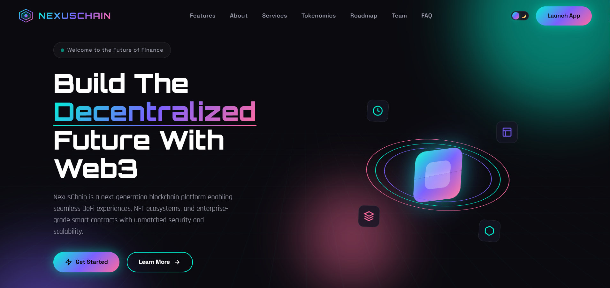

# 🌐 Omkar R. Ghare — NFTVerse Marketplace Landing (v4)

A bold and immersive **NFT marketplace-style landing page** inspired by modern digital asset platforms.

---

## 🚀 Live Demo  
🔗 https://omkarghare8.github.io/web3-blockchain-landing-page-template-v4/

---

## ✨ Features

- NFT card grid layout  
- Dark mode interface  
- Interactive hover effects  
- Creator showcase section  
- Roadmap & FAQ  
- Fully responsive  

---

## 🛠 Tech Stack

- HTML5  
- CSS3  
- JavaScript  

---

## 📸 Preview

---

## 🎯 Purpose of This Project

To design marketplace-inspired Web3 layouts and improve structured UI components.

---

## 👨‍💻 Author

**Omkar R. Ghare**
